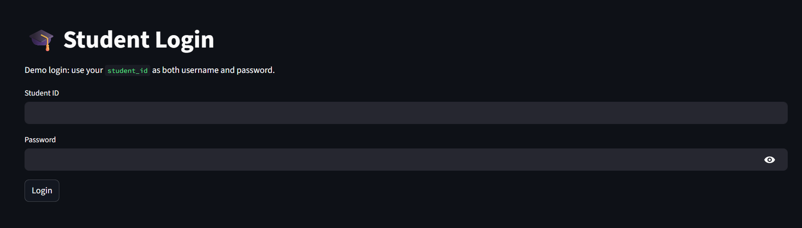
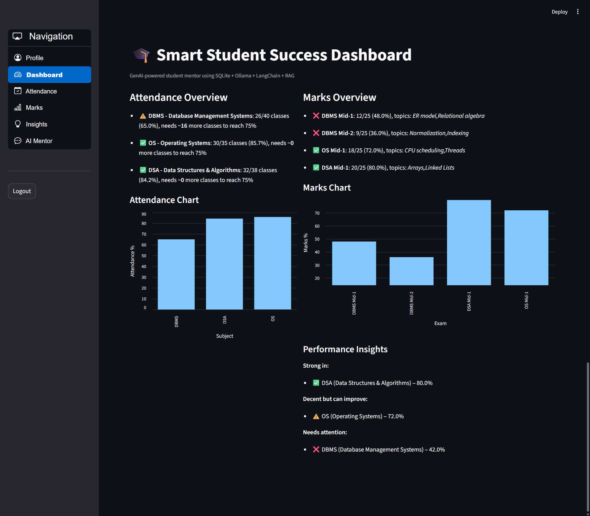
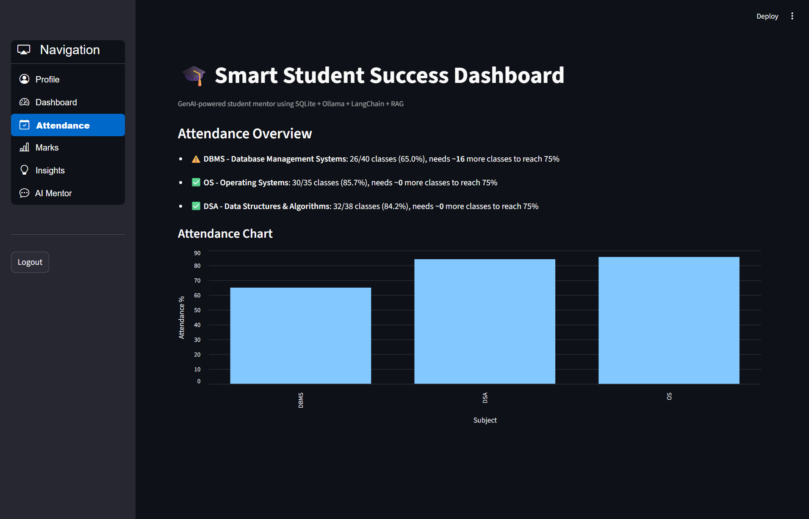
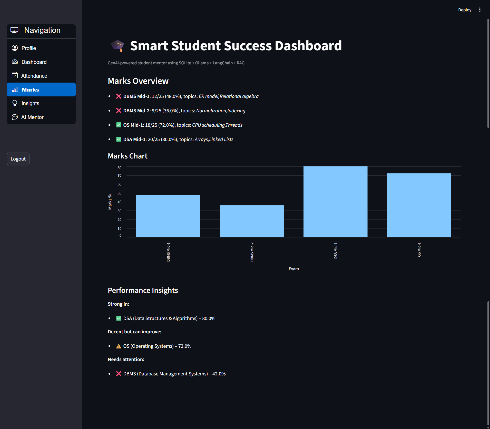
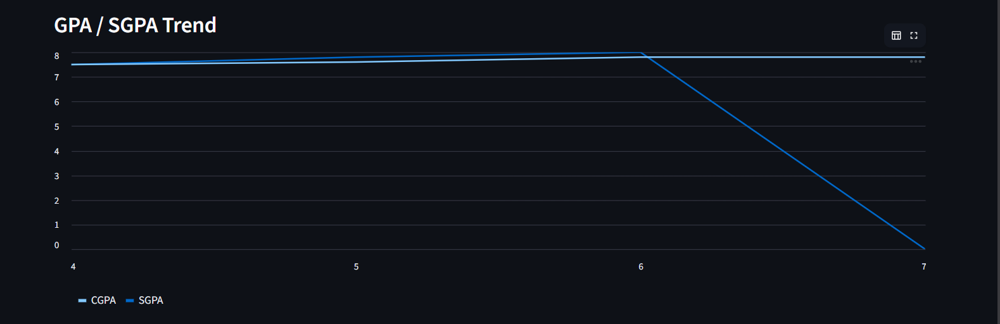
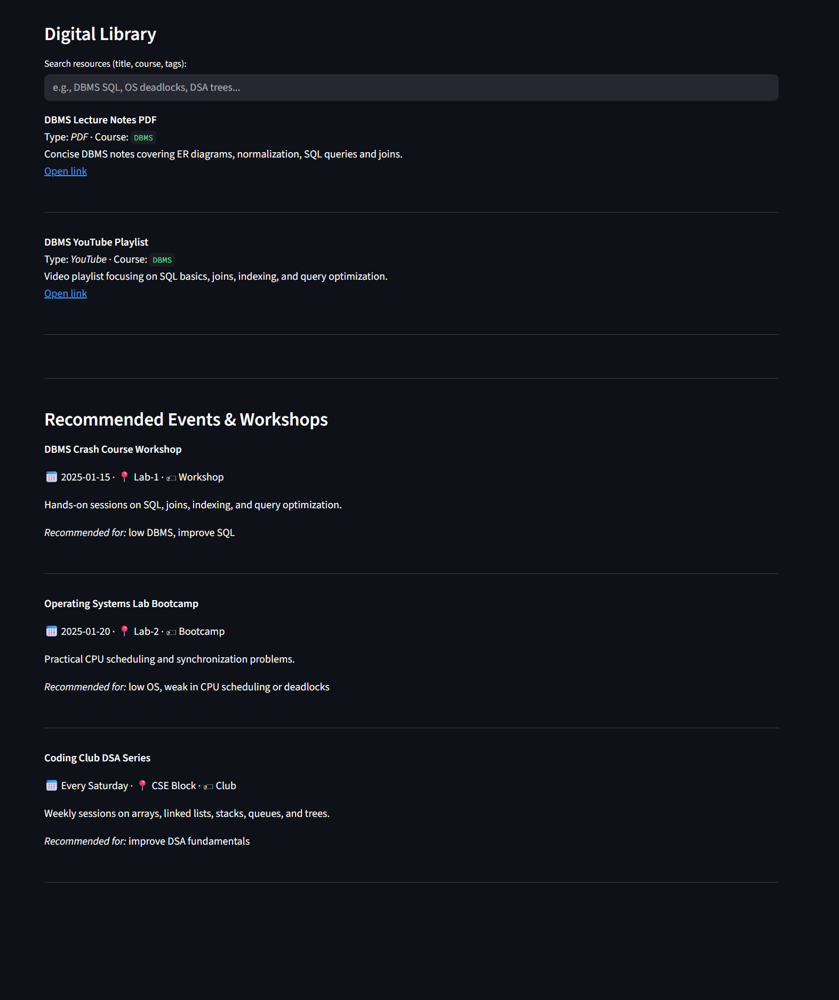
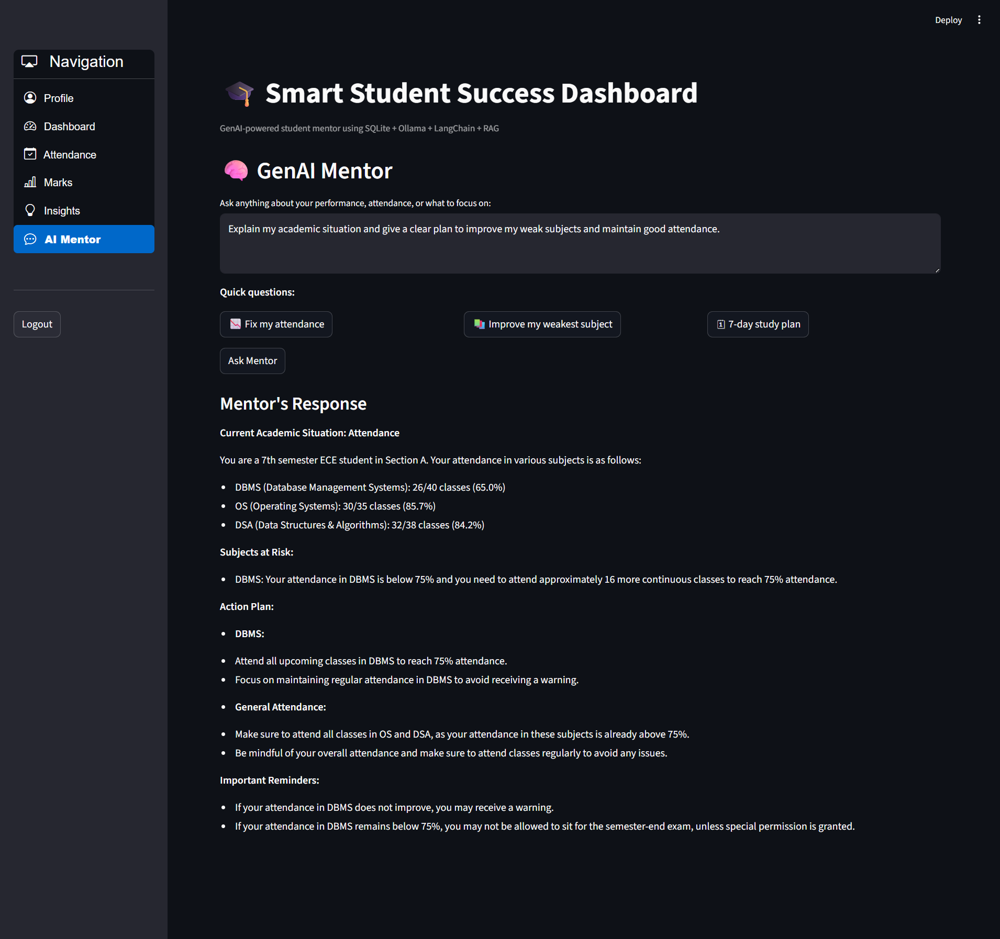

🎓 Smart Student Success Dashboard
GenAI-powered Academic Mentor • RAG • ChromaDB • LangChain • Groq / Ollama LLM
🚀 Overview

The Smart Student Success Dashboard is an AI-powered academic assistant designed to help students track their performance, analyze weaknesses, and receive personalized success recommendations.
It combines structured analytics (attendance, marks, GPA, events, resources) with Generative AI + RAG to provide actionable mentoring guidance based on real student data, not generic responses.

The system demonstrates a real-world application of modern AI engineering:

RAG workflow (chunking → embeddings → vector search → grounded response)

LLM-agnostic architecture (Groq, Gemini, Ollama interchangeable via .env)

Streamlit multi-page dashboard with authentication

Chroma vector database for semantic search

SQLite backend with seed academic data & CRUD layer

🧠 Key Features
Category	Description
🔐 Student Login	Secure access (student_id as username & password)
📊 Dashboard Analytics	Attendance, marks, performance trends, GPA chart
📉 Attendance Insights	Threshold checks and “how many more classes needed” guidance
🎯 Academic Performance	Weak subject detection with topic-wise recommendations
🤖 GenAI Mentor	Personalized suggestions using RAG + student context
🧠 Intent-aware AI	"Fix attendance", "Improve weak subject", "Study plan", etc.
📚 Digital Library	Recommended PDFs / Notes / YouTube resources
🗓 Event Suggestion Cards	Workshop/hackathon opportunities relevant to weaknesses
🔄 Multi-student dataset	Different insights for different profiles
🧩 LLM-switchable	Swap between Groq, Gemini, Ollama with one config
🧠 Tech Stack
Layer	Tools
Frontend	Streamlit (Multi-Page UI + Charts + Components)
Backend	Python, SQLAlchemy CRUD
Database	SQLite
GenAI / LLM	Groq (Llama-3) / Ollama (Mistral) / Gemini-ready
RAG	LangChain, ChromaDB, Semantic Search
Embeddings	nomic-embed-text
Vector Store	Chroma persistent DB
Deployment Ready	Local / Cloud compatible
🏗 Architecture
Frontend (Streamlit UI)
│
├── Login + Dashboard + Attendance + Marks + Insights + Mentor Chat
│
Backend Layer
│
├── SQLite DB (Students, Attendance, Marks, GPA, Events, Library Resources)
│
├── CRUD Service (SQLAlchemy)
│
├── AI Layer (Mentor Engine)
│     ├── Context Builder (student data → rich text)
│     ├── RAG Pipeline (vector search from Chroma)
│     ├── Embeddings (Ollama or Gemini)
│     └── Chat LLM (Groq / Gemini / Ollama)
│
Retrieval Documents (study tips, attendance rules, event descriptions)
│
Vector DB (Chroma with persisted embeddings)
│
Final Response → Streamlit UI

🔧 Installation & Setup
Clone repo
git clone https://github.com/suhasthadaka22/smart-student-success-dashboard.git
cd smart-student-success-dashboard

Create & activate venv
python -m venv venv
venv\Scripts\activate

Install dependencies
pip install -r requirements.txt

⚙ Configure LLM Provider (Groq recommended)
Update .env file
LLM_PROVIDER=groq
EMBED_PROVIDER=ollama

GROQ_API_KEY=YOUR_GROQ_KEY
GROQ_LLM_MODEL=llama-3.1-8b-instant

OLLAMA_LLM_MODEL=mistral
OLLAMA_EMBED_MODEL=nomic-embed-text

To switch to Ollama only:

LLM_PROVIDER=ollama
EMBED_PROVIDER=ollama

▶ Run Application
streamlit run frontend/app.py

📸 Screenshots

Login & Student Profile:

Dashboard View:

Attendance Insights:

Marks Breakdown:

GPA Trend Chart:

Digital Library + Event Cards:

AI Mentor Chat:

🧪 Demo Queries to Try
Type	Example
Attendance Fix	Fix my attendance
Weak Subject	How do I improve my OS performance?
Study Plan	Give me a 7-day study strategy for upcoming mid exams
GPA Target	What CGPA can I target this semester?
Personalized	Summarize my academic situation in bullet points

📈 Future Upgrades:

Admin & Faculty dashboard

Hybrid search (BM25 + semantic)

RAG evaluation & hallucination guardrails

Deployment using Docker + Cloud Run/EC2

Student notifications + timetable module

Voice-enabled mentor

📄 License

MIT License

💼 Author

T. Suhas
🚀 ML / AI Enthusiast | Full Stack Learner | GenAI Developer
📍 Hyderabad, India
🔗 Portfolio Coming Soon
🔗 LinkedIn: www.linkedin.com/in/suhas-thadaka

⭐ Support

If you like this project, please star the repository 🙌
It means a lot and helps visibility!

🌟 Final Thoughts

This project demonstrates practical GenAI engineering — combining structured academic data with retrieval-augmented generation to create personalized AI-driven mentoring. Not just a chatbot, but a real product with analytics, RAG, and performance-based guidance.